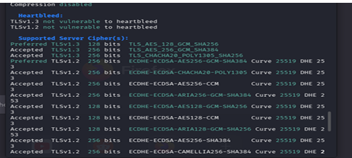
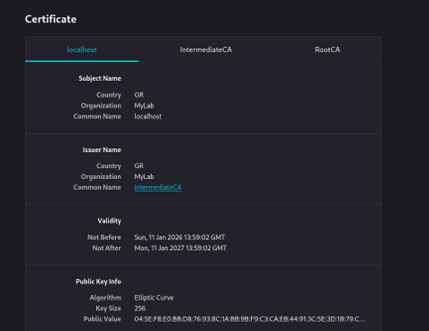

# Enterprise PKI Implementation & Man-in-the-Middle (MitM) Vulnerability Analysis

## Project Overview
This project demonstrates the end-to-end implementation of a secure Public Key Infrastructure (PKI) hierarchy, the configuration of an Apache web server using Elliptic Curve (EC) cryptography, and the enforcement of Mutual TLS (mTLS) authentication. 

Following the defensive setup, an offensive simulation was conducted using ARP Poisoning and Social Engineering to demonstrate the catastrophic impact of Man-in-the-Middle (MitM) attacks on poorly configured local networks, concluding with actionable mitigation strategies.

**Technologies Used:** Kali Linux, OpenSSL, Apache2, Ettercap, Social-Engineer Toolkit (SET), sslscan.

---

## Part 1: Defensive Architecture (Blue Team)

### 1. Root CA & Directory Structure Initialization
To establish a chain of trust, a Root Certificate Authority (CA) was created.

```bash
# Create directory structure
mkdir -p my_pki/{rootCA,interCA,server,client} 
cd my_pki 

# Generate Root CA private key & self-signed certificate
openssl genrsa -aes256 -out rootCA/rootCA.key 4096 
openssl req -x509 -new -nodes -key rootCA/rootCA.key -sha256 -days 3650 -out rootCA/rootCA.crt -subj "/C=GR/O=MyLab/CN=RootCA"
```
**2. Intermediate CA Configuration**

For security best practices, the Root CA is kept offline. An Intermediate CA was generated and signed by the Root CA to handle daily signing operations.

```bash 
# Generate Intermediate CA key & CSR
openssl genrsa -aes256 -out interCA/interCA.key 4096 
openssl req -new -key interCA/interCA.key -out interCA/interCA.csr -subj "/C=GR/O=MyLab/CN=IntermediateCA" 

# Sign the Intermediate CSR with the Root CA
openssl x509 -req -in interCA/interCA.csr -CA rootCA/rootCA.crt -CAkey rootCA/rootCA.key -CAcreateserial -out interCA/interCA.crt -days 1825 -sha256 

# Create the Certificate Chain
cat interCA/interCA.crt rootCA/rootCA.crt > interCA/chain.crt
```
**3. Web Server Elliptic Curve (EC) Keys**

To ensure high security with lower computational overhead, Elliptic Curve (prime256v1) keys were generated for the web server (localhost)
```bash
# Generate EC parameters and private key
openssl ecparam -name prime256v1 -out server/ecparams.pem 
openssl ecparam -in server/ecparams.pem -genkey -noout -out server/server.key 

# Generate CSR and sign with Intermediate CA
openssl req -new -key server/server.key -out server/server.csr -subj "/C=GR/O=MyLab/CN=localhost" 
openssl x509 -req -in server/server.csr -CA interCA/interCA.crt -CAkey interCA/interCA.key -CAcreateserial -out server/server.crt -days 365 -sha256
```
**4. Apache Web Server Hardening & Mutual Authentication (mTLS)**

The certificates were installed on Apache (/etc/apache2/sites-available/default-ssl.conf). To further enhance security, the server was configured to strictly require a valid Client Certificate (mTLS) for access.
```bash
# Server Certificate Configuration
SSLCertificateFile      /home/kali/my_pki/server/server.crt 
SSLCertificateKeyFile   /home/kali/my_pki/server/server.key 
SSLCertificateChainFile /home/kali/my_pki/interCA/chain.crt 

# Mutual Authentication (Client Verification)
SSLCACertificateFile    /home/kali/my_pki/interCA/chain.crt 
SSLVerifyClient require 
SSLVerifyDepth  2
```
```bash

# Generate Client User key & CSR

openssl genrsa -out client/client.key 4096 

openssl req -new -key client/client.key -out client/client.csr -subj "/C=GR/O=MyLab/CN=ClientUser" 


# Sign the Client CSR with the Intermediate CA

openssl x509 -req -in client/client.csr -CA interCA/interCA.crt -CAkey interCA/interCA.key -CAcreateserial -out client/client.crt -days 365 -sha256 


# Export to .p12 format for browser import

openssl pkcs12 -export -inkey client/client.key -in client/client.crt -out client/client.p12

```


**Validation:** Security configurations were audited using `sslscan`.

  


## Part 2: Offensive Simulation (Red Team)


### Man-in-the-Middle (MitM) & Credential Harvesting

To highlight the vulnerabilities of local area networks lacking proper security controls, a targeted MitM attack was executed against a simulated victim.


1. **Social Engineering:** Utilized the **Social-Engineer Toolkit (SET)** (Credential Harvester -> Site Cloner) to clone the Google login page.

2. **Traffic Interception:** Launched **Ettercap** to perform ARP Poisoning, successfully intercepting and routing the victim's traffic through the attacker's machine.


  ---


## Part 3: Threat Mitigation & Incident Response


The offensive simulation demonstrated the ease of intercepting local traffic when Layer 2 security is neglected. The following protocols are recommended to mitigate such vectors:


* **HTTP Strict Transport Security (HSTS):** Enforcing HSTS on the server side ensures browsers exclusively connect via encrypted HTTPS, nullifying the effectiveness of unencrypted cloned HTTP pages used in the attack.

* **Dynamic ARP Inspection (DAI):** Activating DAI on enterprise network switches prevents ARP Spoofing by validating ARP packets and dropping malicious MAC-to-IP binding attempts.

* **Encrypted Tunnels (VPNs):** End-user implementation of Virtual Private Networks (VPNs) creates an encrypted tunnel, rendering intercepted data illegible to attackers during a MitM scenario.

* **Security Awareness:** The cloned login page lacked a valid SSL/TLS certificate (missing the padlock/marked as "Not Secure"). Continuous user training on URL verification remains the first line of defense against social engineering.


